# linfer

`linfer` is a local LLM workflow tool written in Rust.

[](https://github.com/ragibcs/linfer/stargazers)
[](https://github.com/ragibcs/linfer/network/members)
[](https://github.com/ragibcs/linfer/issues)
[](https://github.com/ragibcs/linfer)

It can:
- get models from Hugging Face
- put them all together in a local `.`lnf packages- start local generation from the terminal
- check the speed of token generation
- provide a simple HTTP API like Ollama's (`/api/tags`, `/api/generate`)

> Status: early-stage prototype.

## Features

- A Rust workspace with different crates for each part, such as `linfer-ir`, `linfer-compiler`, `linfer-runtime`, `linfer-cli`, and so on.
- HF model pull and handling of safetensors, tokenizer, and config
- For the local model registry, you can use the commands `pull`, `list`/`ps`, `info`, and `rm`.
- Options for the command line interface include `--max-tokens`, `--temperature`, `--top-k`, and `--top-p`.
- The "serve" mode, which runs an HTTP server, allows you to use the API locally. 

## Model Architectures

Here's a rundown of the architecture adapters currently available:
- llama
- mistral
- phi
- qwen
- gemma

If you want to see this list from the command line, just run:

```bash
linfer list-archs
```

## Architecture Diagram



- **Gated/private models:** need a Hugging Face token to work.

Set the token before pulling if you need to:

```bash
export HF_TOKEN="your_hf_token"
```

Set a writable local directory as well if your filesystem is read-only or limited:

```bash
export LINFER_HOME="$HOME/.linfer"
```

## Build

```bash
cargo build --release
```

Binary path:

```bash
./target/release/linfer
```

## Arch Linux one-line install

From terminal, run:

```bash
git clone https://github.com/ragibcs/linfer.git ~/.cache/linfer-src && bash ~/.cache/linfer-src/scripts/install-arch.sh
```

After install, open a new terminal and use:

```bash
linfer pull "TinyLlama/TinyLlama-1.1B-Chat-v1.0" --quant q4
```

## Quick Start

### 1) Pull a model

```bash
./target/release/linfer pull "TinyLlama/TinyLlama-1.1B-Chat-v1.0" --quant q4
```

### 2) List local models

```bash
./target/release/linfer list
# or
./target/release/linfer ps
```

### 3) Run a prompt

```bash
./target/release/linfer run "TinyLlama/TinyLlama-1.1B-Chat-v1.0" "Explain AI in one line" --max-tokens 60
```

You can also run by explicit local bundle path:

```bash
./target/release/linfer run "/absolute/path/to/model.lnf" "hello"
```

### 4) Benchmark

```bash
./target/release/linfer bench "TinyLlama/TinyLlama-1.1B-Chat-v1.0" --tokens 200
```

### 5) Start local server

```bash
./target/release/linfer serve --host 127.0.0.1 --port 11434
```

Example API calls:

```bash
curl http://127.0.0.1:11434/api/tags
```

```bash
curl -X POST http://127.0.0.1:11434/api/generate \
  -H "content-type: application/json" \
  -d '{"model":"TinyLlama/TinyLlama-1.1B-Chat-v1.0","prompt":"Hello"}'
```

## CLI Commands

```text
linfer compile <HF_MODEL_ID> --quant <q4|q8> --output <PATH>
linfer pull <HF_MODEL_ID> [--quant <q4|q8>]
linfer run <MODEL> <PROMPT> [--max-tokens N] [--temperature F] [--top-k N] [--top-p F]
linfer bench <MODEL> [--tokens N]
linfer info <MODEL>
linfer list
linfer ps
linfer rm <MODEL>
linfer serve [--host HOST] [--port PORT] [--model MODEL]
linfer list-archs
```

## Storage Paths

By default, `linfer` keeps local data in a writable app directory.
You can change it with:

```bash
export LINFER_HOME=/path/to/writable/dir
```

This is helpful on systems where the default locations can't be changed.

Development

To confirm that everything's in order, execute these commands:

```bash
cargo check
cargo test
```

License

GNU GENERAL PUBLIC LICENSE

